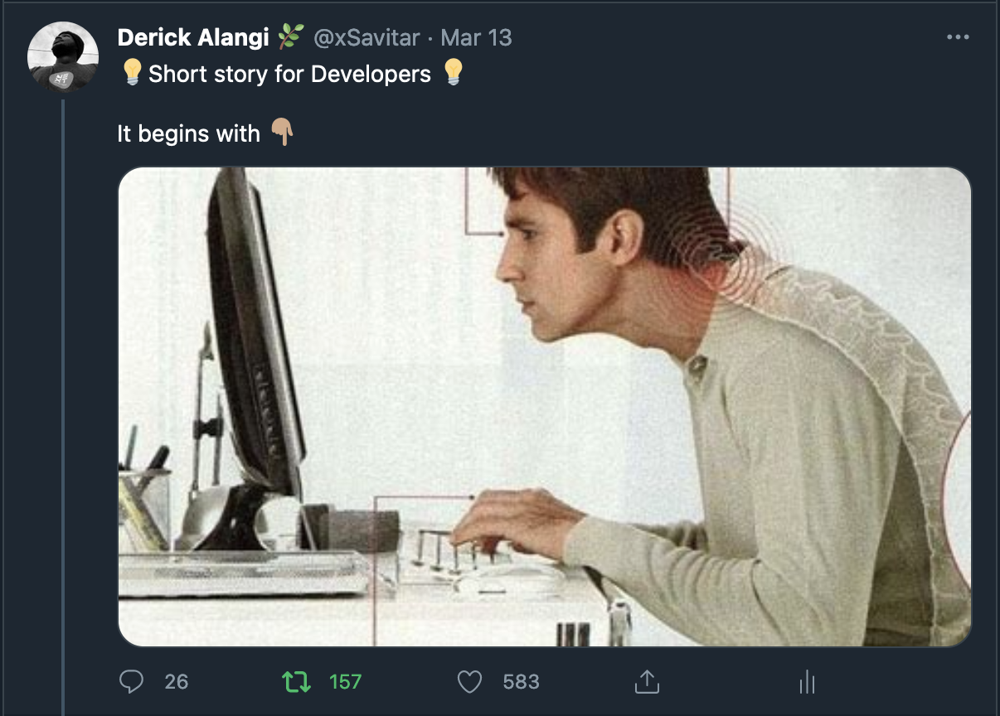
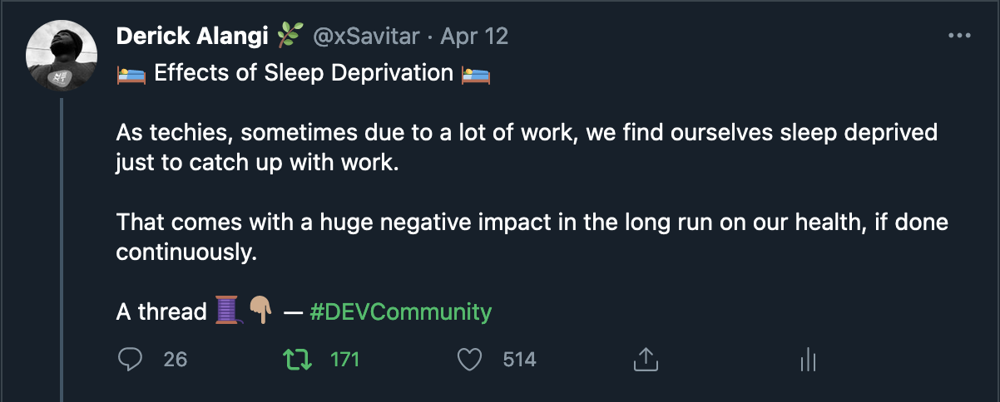
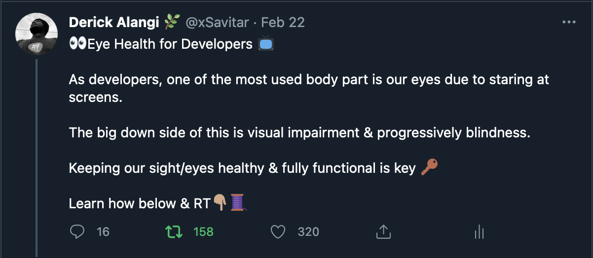

# Developer Health Tweets

Simple repository with Derick's semi-viral or viral tweets related to Developer Health.

# Tweet threads are listed below

* **Tips to stay health as a developer**:
  https://twitter.com/xsavitar/status/1363087909813968900?s=21

* **Demerits of developers bad sitting postures**:
  https://twitter.com/xsavitar/status/1370705988676947970?s=21

* **Effects of sleep deprivation**:
  https://twitter.com/xsavitar/status/1381510813429727235?s=21

* **Improvement of eye health for developers**:
  https://twitter.com/xsavitar/status/1363782677141274624?s=21

* **Morning Yoga poses to start your day**:
  https://twitter.com/xSavitar/status/1396685005703757827

* **Benefits of good posture**:
  https://twitter.com/xsavitar/status/1372552961545605121?s=21

